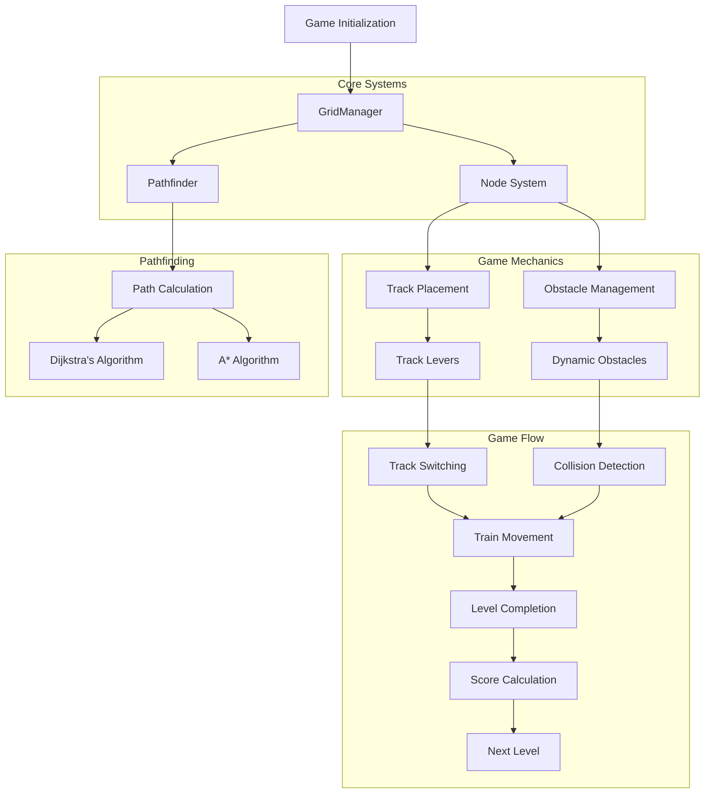
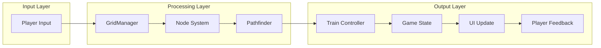
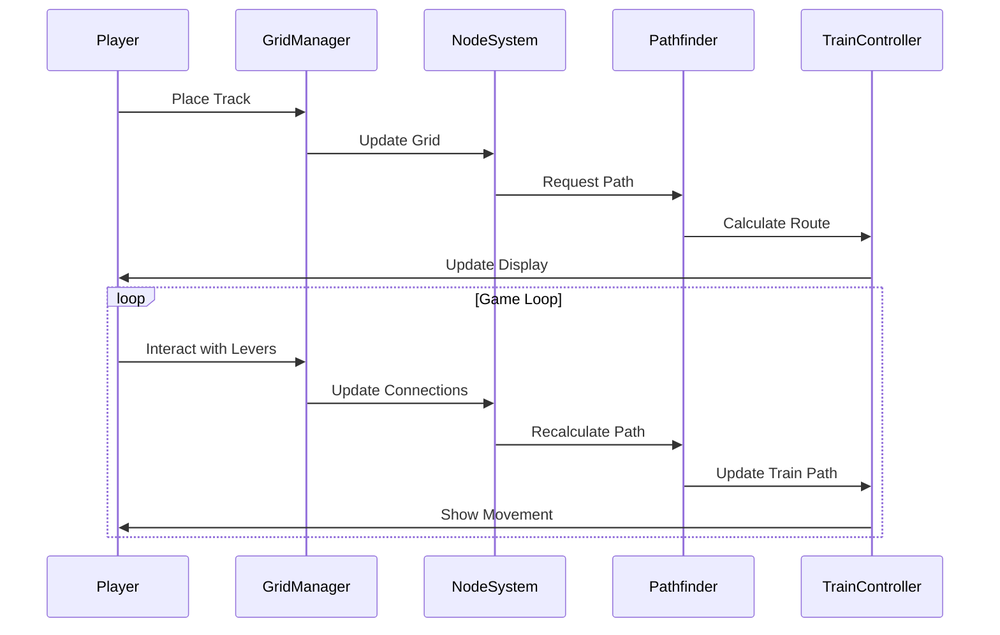
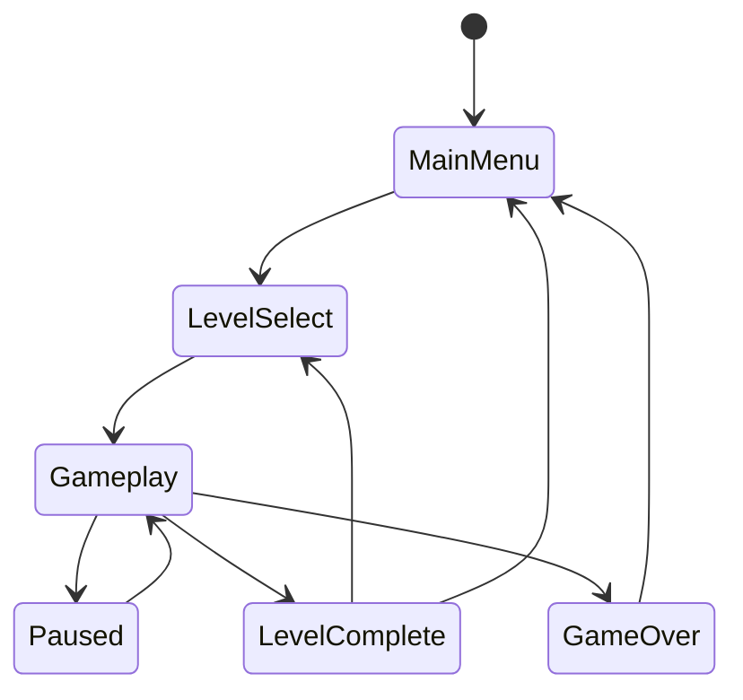

# TrackLock System Flowchart

## System Architecture Flow

## Data Flow Diagram

## Component Interaction

## State Management

These diagrams provide a visual representation of:
1. The overall system architecture and component relationships
2. Data flow through the system
3. Component interactions and sequences
4. Game state management

The diagrams are created using Mermaid, which is supported by GitHub and many other markdown viewers. You can view these diagrams directly on GitHub or any other platform that supports Mermaid syntax. 